---
## Front matter
lang: ru-RU
title: Лабораторная работа №5
author: |
        талебу тенке фрнк устон
        
## i18n babel
babel-lang: russian
babel-otherlangs: english

## i18n babel
babel-lang: russian
babel-otherlangs: english

## Formatting pdf
toc: false
toc-title: Содержание
slide_level: 2
aspectratio: 169
section-titles: true
theme: metropolis
header-includes:
 - \metroset{progressbar=frametitle,sectionpage=progressbar,numbering=fraction}
 - '\makeatletter'
 - '\beamer@ignorenonframefalse'
 - '\makeatother'
---

## Цель работы

Цель работы является научиться настраивать рабочую среду.

## Задание

- Менеджер паролей pass
- Дополнительное программное обеспечение
- Ежедневные операции c chezmoi

## Менеджер паролей pass

- установка pass. 

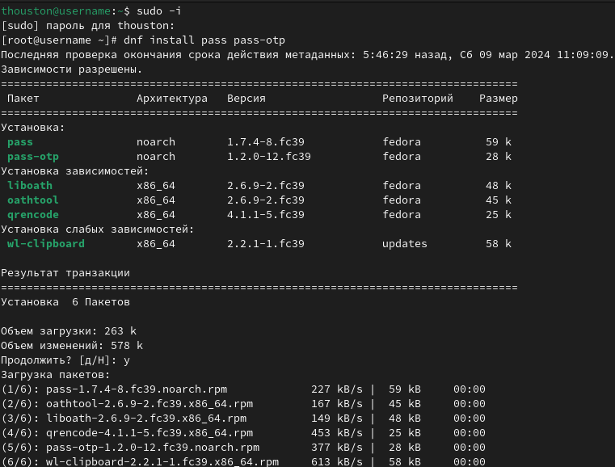{#fig:001 width=100%}

- установка gopass. 

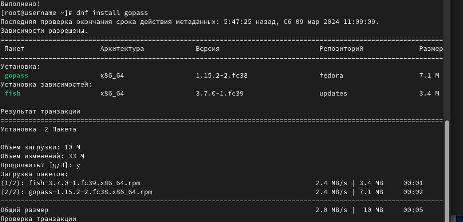{#fig:002 width=100%}

- Настройка ключи GPG.

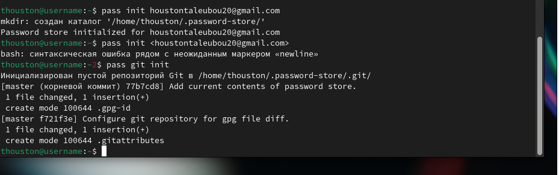{#fig:003 width=100%}

- Инициализация хранилища 

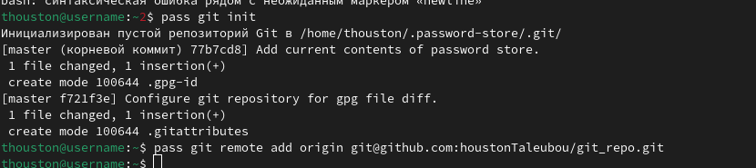{#fig:004 width=100%}

- Синхронизация с git. Создаём структуру git. 

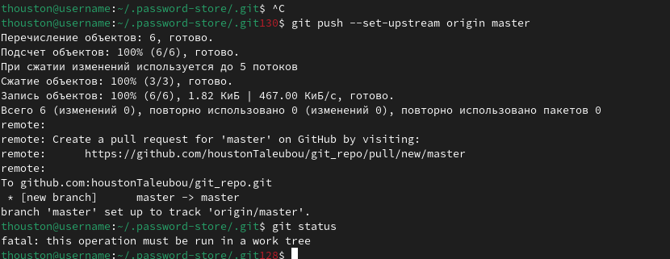{#fig:005 width=100%}

- создание новой репозитории. 

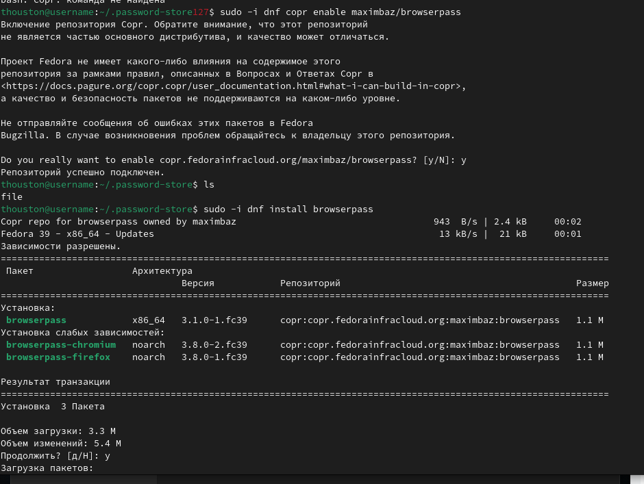{#fig:006 width=100%}

- Прямые изменения. 

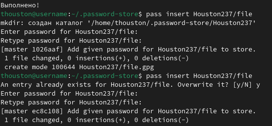{#fig:007 width=100%}

## Настройка интерфейса с броузером

- Интерфейс для взаимодействия с броузером (native messaging). 

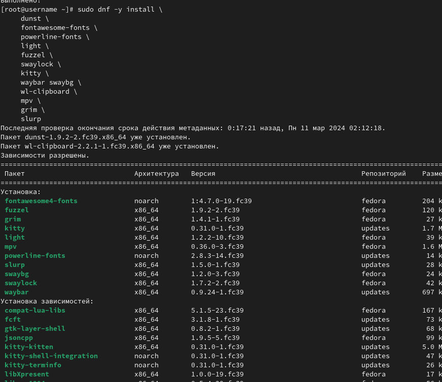{#fig:008 width=100%}

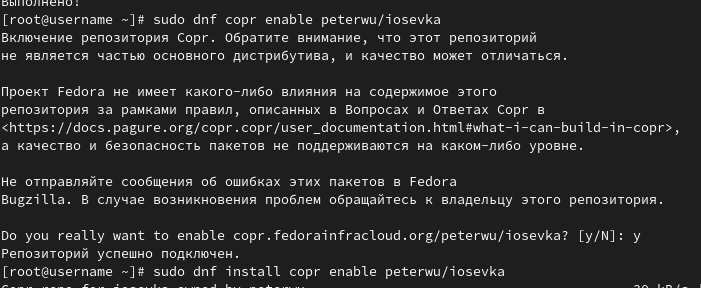{#fig:009 width=100%}

## Сохранение пароля

- Добавить новый пароль. Отображение пароль для указанного имени файла

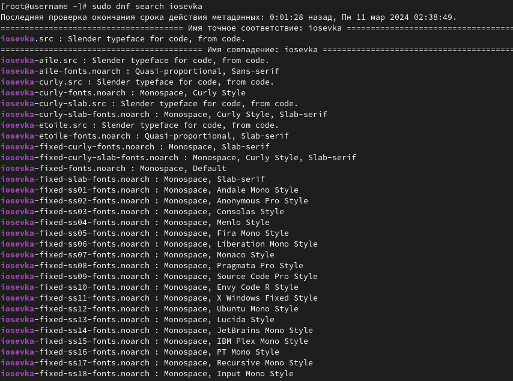{#fig:010 width=100%}

- Замените существующий пароль 

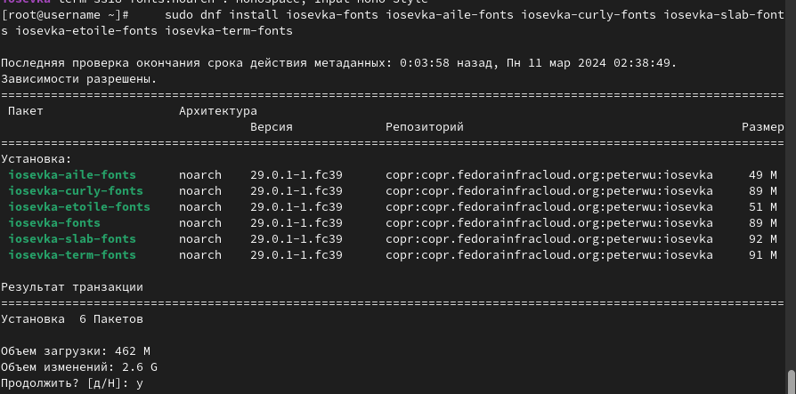{#fig:011 width=100%}

## Дополнительное программное обеспечение

- Установка дополнительного программного обеспечении. 

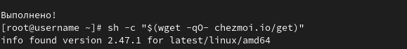{#fig:012 width=100%}

- Установка шрифты. 

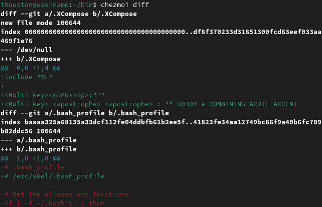{#fig:013 width=100%}

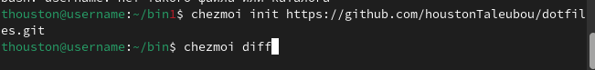{#fig:014 width=100%}

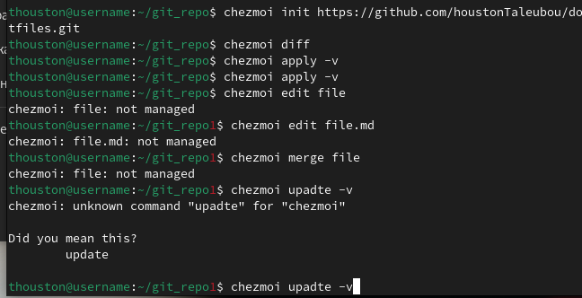{#fig:015 width=100%}

- Установка бинарного файла. Скрипт определяет архитектуру процессора и операционную систему и скачивает необходимый файл. 

{#fig:016 width=100%}

## Создание собственного репозитория с помощью утилит

- Будем использовать утилиты командной строки для работы с github. Создадим свой репозиторий для конфигурационных файлов на основе шаблона. 

{#fig:017 width=100%}

## Подключение репозитория к своей системе

- Инициализация chezmoi с вашим репозиторием dotfiles. 

{#fig:018 width=100%}

- Проверка, какие изменения внесёт chezmoi в домашний каталог, запустив. 

{#fig:019 width=100%}

## Ежедневные операции c chezmoi

- Извлеките последние изменения из репозитория и примените их.

{#fig:020 width=100%}

- Извлеките последние изменения из своего репозитория и посмотрите, что изменится, фактически не применяя изменения. 

{#fig:021 width=100%}

- Автоматически фиксируйте и отправляйте изменения в репозиторий. 

{#fig:022 width=100%}

# Выводы

- В этой лабораторной работе, я научила настраивать рабочую среду.

Спасибо за внимание

