---
## Front matter
title: "Лабораторная работа №5"
subtitle: "Настройка рабочей среды"
author: "талебу тенке франк"

## Generic otions
lang: ru-RU
toc-title: "Содержание"

## Bibliography
bibliography: bib/cite.bib
csl: pandoc/csl/gost-r-7-0-5-2008-numeric.csl

## Pdf output format
toc: true # Table of contents
toc-depth: 2
lof: true # List of figures
lot: true # List of tables
fontsize: 12pt
linestretch: 1.5
papersize: a4
documentclass: scrreprt
## I18n polyglossia
polyglossia-lang:
  name: russian
  options:
	- spelling=modern
	- babelshorthands=true
polyglossia-otherlangs:
  name: english
## I18n babel
babel-lang: russian
babel-otherlangs: english
## Fonts
mainfont: PT Serif
romanfont: PT Serif
sansfont: PT Sans
monofont: PT Mono
mainfontoptions: Ligatures=TeX
romanfontoptions: Ligatures=TeX
sansfontoptions: Ligatures=TeX,Scale=MatchLowercase
monofontoptions: Scale=MatchLowercase,Scale=0.9
## Biblatex
biblatex: true
biblio-style: "gost-numeric"
biblatexoptions:
  - parentracker=true
  - backend=biber
  - hyperref=auto
  - language=auto
  - autolang=other*
  - citestyle=gost-numeric
## Pandoc-crossref LaTeX customization
figureTitle: "Рис."
tableTitle: "Таблица"
listingTitle: "Листинг"
lofTitle: "Список иллюстраций"
lotTitle: "Список таблиц"
lolTitle: "Листинги"
## Misc options
indent: true
header-includes:
  - \usepackage{indentfirst}
  - \usepackage{float} # keep figures where there are in the text
  - \floatplacement{figure}{H} # keep figures where there are in the text
---

# Цель работы

- Цель работы является научиться настраивать рабочую среду.

# Задание

- 1. Менеджер паролей pass
- 2. Дополнительное программное обеспечение
- 3. Ежедневные операции c chezmoi

# Выполнение лабораторной работы

## Менеджер паролей pass

- установка pass. (рис. [-@fig:001]).

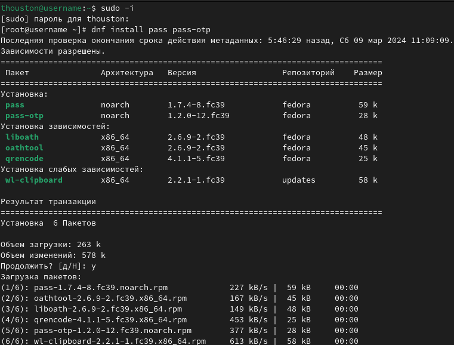{#fig:001 width=100%}

- установка gopass. (рис. [-@fig:002]).

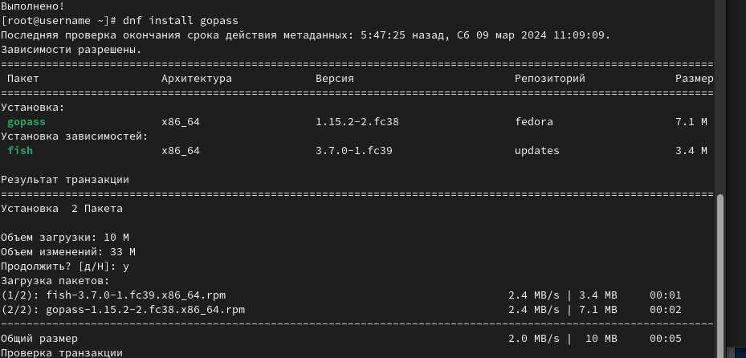{#fig:002 width=100%}

- Настройка ключи GPG. (рис. [-@fig:003]).

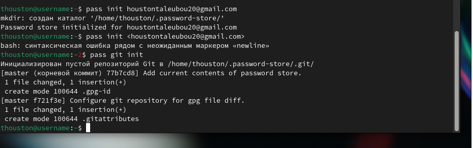{#fig:003 width=100%}

- Инициализация хранилища (рис. [-@fig:004]).

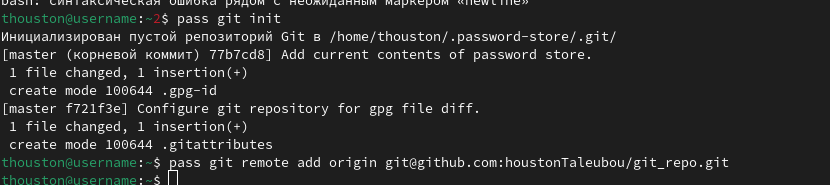{#fig:004 width=100%}

- Синхронизация с git. Создаём структуру git. (рис. [-@fig:005]).

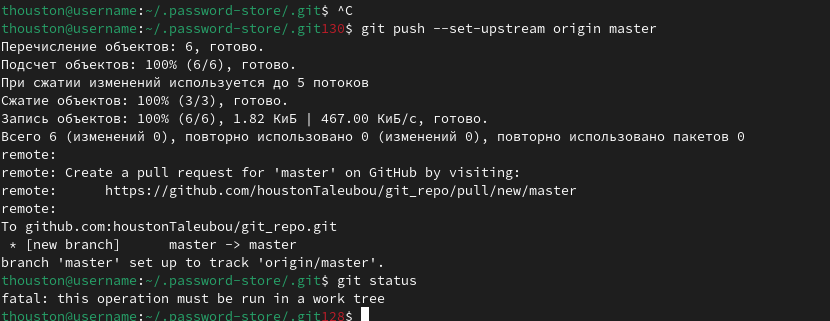{#fig:005 width=100%}

- создание новой репозитории. (рис. [-@fig:006]).

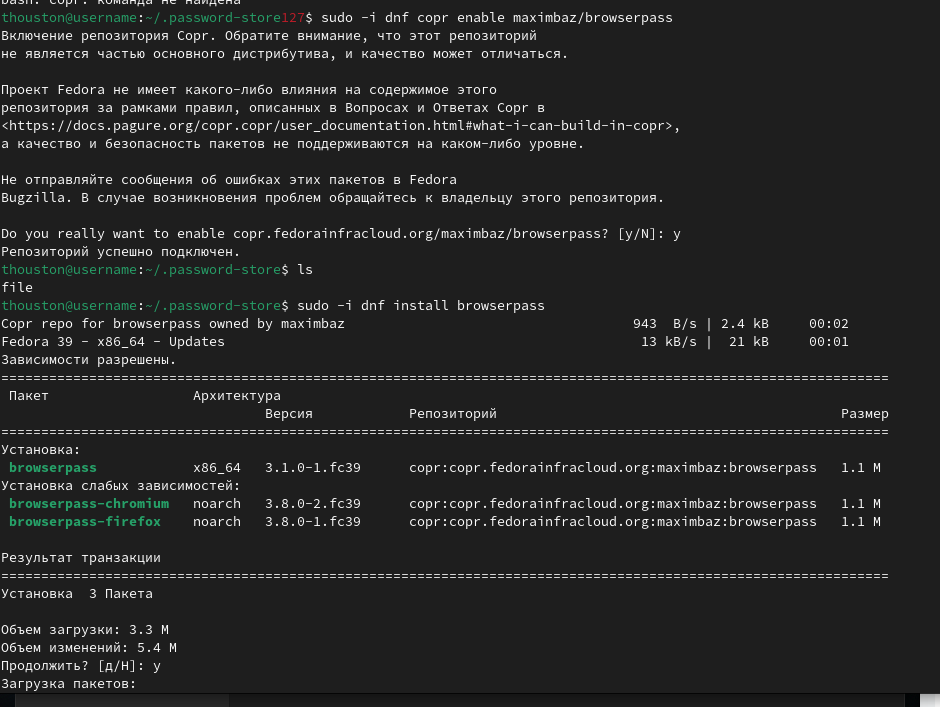{#fig:006 width=100%}

- Прямые изменения. (рис. [-@fig:007]).

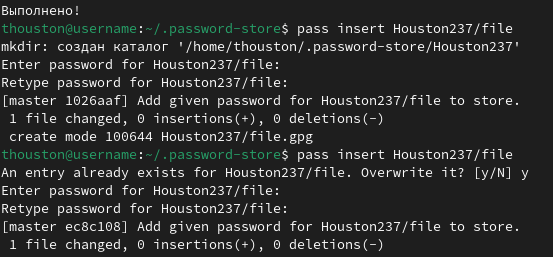{#fig:007 width=100%}

## Настройка интерфейса с броузером

- Интерфейс для взаимодействия с броузером (native messaging). (рис. [-@fig:008]).

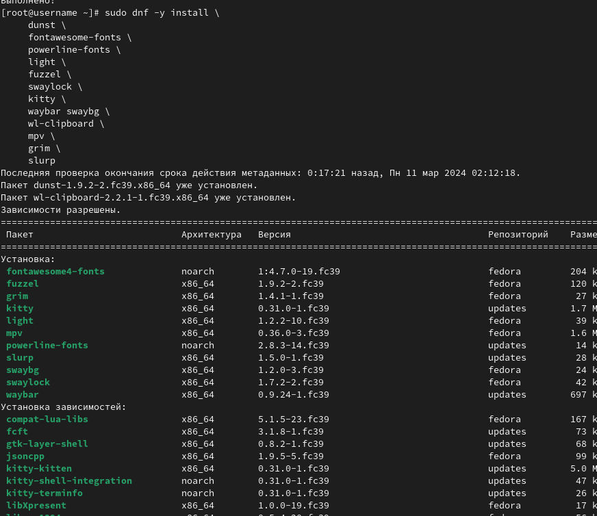{#fig:008 width=100%}

- (рис. [-@fig:009]).

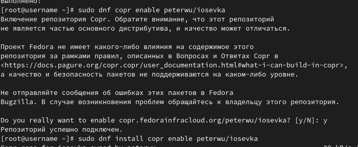{#fig:009 width=100%}

## Сохранение пароля

- Добавить новый пароль. Отображение пароль для указанного имени файла (рис. [-@fig:010]).

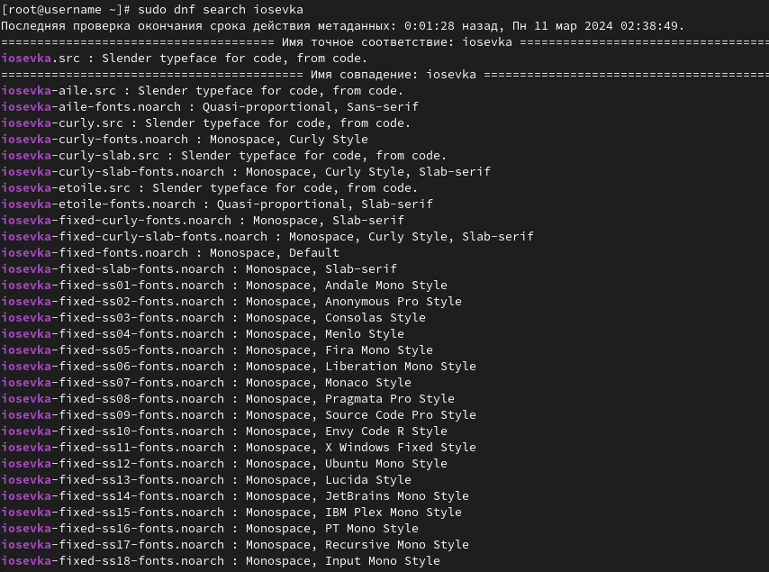{#fig:010 width=100%}

- Замените существующий пароль (рис. [-@fig:011]).

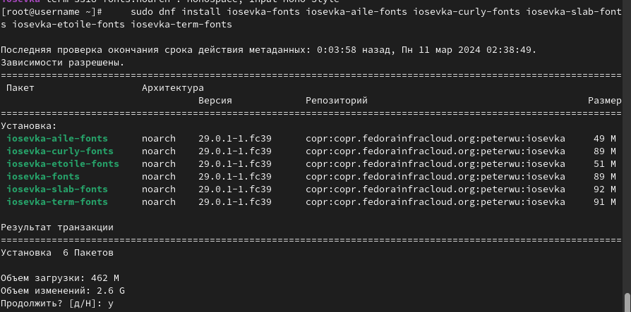{#fig:011 width=100%}

## Дополнительное программное обеспечение

- Установка дополнительного программного обеспечении. (рис. [-@fig:012]).

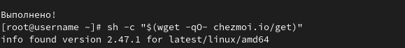{#fig:012 width=100%}

- Установка шрифты. (рис. [-@fig:013]).

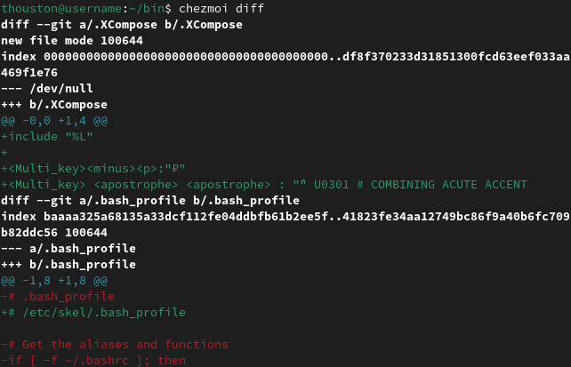{#fig:013 width=100%}

 (рис. [-@fig:014]).

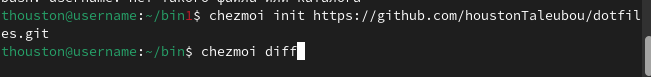{#fig:014 width=100%}

 (рис. [-@fig:015]).

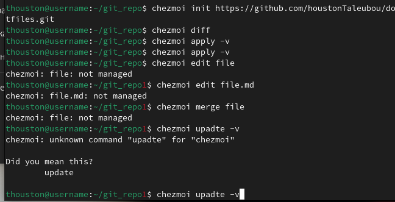{#fig:015 width=100%}

- Установка бинарного файла. Скрипт определяет архитектуру процессора и операционную систему и скачивает необходимый файл. (рис. [-@fig:016]).

{#fig:016 width=100%}

## Создание собственного репозитория с помощью утилит

- Будем использовать утилиты командной строки для работы с github. Создадим свой репозиторий для конфигурационных файлов на основе шаблона. (рис. [-@fig:017]).

{#fig:017 width=100%}

## Подключение репозитория к своей системе

- Инициализация chezmoi с вашим репозиторием dotfiles. (рис. [-@fig:018]).

{#fig:018 width=100%}

- Проверка, какие изменения внесёт chezmoi в домашний каталог, запустив. (рис. [-@fig:019]).

{#fig:019 width=100%}

## Ежедневные операции c chezmoi

- Извлеките последние изменения из репозитория и примените их. (рис. [-@fig:020]).

{#fig:020 width=100%}

- Извлеките последние изменения из своего репозитория и посмотрите, что изменится, фактически не применяя изменения. (рис. [-@fig:021]).

{#fig:021 width=100%}

- Автоматически фиксируйте и отправляйте изменения в репозиторий. (рис. [-@fig:022]).

{#fig:022 width=100%}

# Выводы

- В этой лабораторной работе, я научила настраивать рабочую среду.

# Список литературы{.unnumbered}

::: {#refs}
:::
