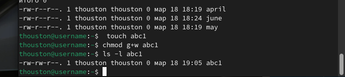

---
## Front matter
lang: ru-RU
title: "Лабораторная работа №7. Анализ файловой системы Linux. Команды для работы с файлами и каталогами"
author: |
	Талебу тенке ф.у
institute:
  - Российский университет дружбы народов, Москва, Россия
  - Объединённый институт ядерных исследований, Дубна, Россия
date: 01 января 1970

## i18n babel
babel-lang: russian
babel-otherlangs: english

## Formatting pdf
toc: false
toc-title: Содержание
slide_level: 2
aspectratio: 169
section-titles: true
theme: metropolis
header-includes:
 - \metroset{progressbar=frametitle,sectionpage=progressbar,numbering=fraction}
 - '\makeatletter'
 - '\beamer@ignorenonframefalse'
 - '\makeatother'
---

## Содержание

1. Выполните все примеры
2. Выполните следующие действия
3. Определите опции команды chmod
4. Проделайте приведённые ниже упражнения
5. Прочитайте man

## Цель

- Ознакомление с файловой системой Linux, её структурой, именами и содержанием каталогов. Приобретение практических навыков по применению команд для работы с файлами и каталогами, по управлению процессами (и работами), по проверке исполь-
зования диска и обслуживанию файловой системы.

## Процесс выполнения

## Выполнение все примеры

- Копирование файла в текущем каталоге. Скопировать файл ~/abc1 в файл april и в файл may:

{#fig:001 width=100%}

- Копирование нескольких файлов в каталог. Скопировать файлы april и may в каталог monthly: 

{#fig:002 width=100%}

- Копирование файлов в произвольном каталоге. Скопировать файл monthly/may в файл с именем june: 

{#fig:003 width=100%} 

- Копирование каталогов в текущем каталоге. Скопировать каталог monthly в каталог monthly.00 и monthly.00 в каталог /tmp 

{#fig:004 width=100%}

- Переименование файлов в текущем каталоге. Изменить название файла april на july в домашнем каталоге: 

{#fig:005 width=100%}

- Перемещение файлов в другой каталог. Переместить файл july в каталог monthly.00: 

{#fig:006 width=100%}
 
- Перемещение каталога в другой каталог. Переместить каталог monthly.01в каталог reports: 

{#fig:008 width=100%}

- Переименование каталога, не являющегося текущим. Переименовать каталог reports/monthly.01 в reports/monthly: 

{#fig:009 width=100%}

- Изменение прав доступа. Требуется создать файл ~/may с правом выполнения для владельца: 

{#fig:010 width=100%}

- Требуется лишить владельца файла ~/may права на выполнение: 

{#fig:011 width=100%}

- Требуется создать каталог monthly с запретом на чтение для членов группы и всех остальных пользователей: 

{#fig:012 width=100%}

- Требуется создать файл ~/abc1 с правом записи для членов группы: 

{#fig:013 width=100%}

## Выполнение следующего действия

- Скопируем файл /usr/include/sys/io.h в домашний каталог и название его equipment. Если файла io.h нет, то используйте любой другой файл в каталоге /usr/include/sys/ вместо него. 

{#fig:014 width=100%}

- В домашнем каталоге, создаём директорию ~/ski.plases. 

{#fig:015 width=100%}

- Перемены файла equipment в каталог ~/ski.plases. 

{#fig:016 width=100%}

-  Переименование файла ~/ski.plases/equipment в ~/ski.plases/equiplist. 

{#fig:017 width=100%}

- Создаём в домашнем каталоге файл abc1 и скопируем его в каталог ~/ski.plases, назовите его equiplist2. 

{#fig:018 width=100%}

- Создаём каталог с именем equipment в каталоге ~/ski.plases. И перемены файлов ~/ski.plases/equiplist и equiplist2 в каталог ~/ski.plases/equipment. 

{#fig:019 width=100%}

- Создание и перемены каталога ~/newdir в каталог ~/ski.plases и название его plans. 

{#fig:020 width=100%}

- Определите опции команды chmod

{#fig:023 width=100%}

## Проделать приведённые ниже упражнения

- Просмотр содержимого файла /etc/password. 

{#fig:024 width=100%}

- Скопируем файл ~/feathers в файл ~/file.old.

{#fig:025 width=100%}

-  Перемены файл ~/file.old в каталог ~/play. 

{#fig:026 width=100%}

- Перемены файла ~/file.old в каталог ~/play. Скопируем каталог ~/play в каталог ~/fun. Перемены каталога ~/fun в каталог ~/play и назовите его games. Лишение владельца файла ~/feathers права на чтение. 

{#fig:027 width=100%}

## Прочитайте man

- Прочитайте man по командам mount, fsck, mkfs, kill и кратко их охарактеризуйте, приведя примеры. 

{#fig:028 width=100%}

# Выводы

- Ознакомилась с файловой системой Linux и с ее структурой. Научилась использовать различные команды в терминале для работы с файлами и каталогами.

## Список литературы

1. Командная строка Windows [Электронный ресурс]. URL:
https://foxford.ru/wiki/informatika/komandnaya-stroka-windows.

## {.standout}

Спасибо за внимания
