---
## Front matter
lang: ru-RU
title: Лабораторная работа №9
author: |
	Талебу Т.Ф; НКНбд-05-23
institute: |
	\inst{1}RUDN University, Moscow, Russian Federation

## Formatting
toc: false
slide_level: 2
theme: metropolis
header-includes: 
 - \metroset{progressbar=frametitle,sectionpage=progressbar,numbering=fraction}
 - '\makeatletter'
 - '\beamer@ignorenonframefalse'
 - '\makeatother'
aspectratio: 43
section-titles: true
---

## Цель работы

Освоение основных возможностей командной оболочки Midnight Commander. Приобретение навыков практической работы по просмотру каталогов и файлов; манипуляций с ними.

## Задание

Задание по mc:
1. Изучите информацию о mc, вызвав в командной строке man mc.
2. Запустите из командной строки mc, изучите его структуру и меню.
3. Выполните несколько операций в mc, используя управляющие клавиши (операции
с панелями; выделение/отмена выделения файлов, копирование/перемещение файлов, получение информации о размере и правах доступа на файлы и/или каталоги и т.п.)
4. Выполните основные команды меню левой (или правой) панели. Оцените степень подробности вывода информации о файлах.
5. Используя возможности подменю Файл , выполните:
– просмотр содержимого текстового файла;
– редактирование содержимого текстового файла (без сохранения результатов редактирования);
– создание каталога;
– копирование файлов в созданный каталог.

## Задание

6. С помощью соответствующих средств подменю Команда осуществите:
- поиск в файловой системе файла с заданными условиями (например, файла с расширением .c или .cpp, содержащего строку main);
- выбор и повторение одной из предыдущих команд;
- переход в домашний каталог;
- анализ файла меню и файла расширений.
7. Вызовите подменю Настройки . Освойте операции, определяющие структуру экрана mc (Full screen, Double Width, Show Hidden Files и т.д.)

## Задание

Задание по встроенному редактору mc:
1. Создайте текстовой файл text.txt.
2. Откройте этот файл с помощью встроенного в mc редактора.
3. Вставьте в открытый файл небольшой фрагмент текста, скопированный из любого другого файла или Интернета.
4. Проделайте с текстом следующие манипуляции, используя горячие клавиши:
- Удалите строку текста.
- Выделите фрагмент текста и скопируйте его на новую строку.
- Выделите фрагмент текста и перенесите его на новую строку.
- Сохраните файл.
- Отмените последнее действие.
- Перейдите в конец файла (нажав комбинацию клавиш) и напишите некоторый текст.
- Перейдите в начало файла (нажав комбинацию клавиш) и напишите некоторый текст.
- Сохраните и закройте файл.
5. Откройте файл с исходным текстом на некотором языке программирования (например C или Java)
6. Используя меню редактора, включите подсветку синтаксиса, если она не включена, или выключите, если она включена.

## Теоретическое введение

Командная оболочка — интерфейс взаимодействия пользователя с операционной системой и программным обеспечением посредством команд. 
Midnight Commander (или mc) — псевдографическая командная оболочка для UNIX/Linux систем. Для запуска mc необходимо в командной строке набрать mc и нажать Enter .

MC имеет много полезных как для пользователей, так и для администраторов, функций (копирование, удаление, переименование/перемещение, создание директорий).

## Теоретическое введение

Главное  окно  программы  Midnight  Commander  состоит из трех полей. Два поля, называемые "панелями", идентичны по структуре и  обычно  отображают  перечни  файлов  и  подкаталогов каких-то  двух каталогов файловой структуры. Эти каталоги в общем случае различны, хотя, в частности, могут  и  совпасть.  Каждая  панель  состоит  из  заголовка,  списка  файлов  и информационной строки.

Третье поле экрана,  расположенное  в  нижней  части  экрана,  содержит командную  строку текущей оболочки. В этом же поле (самая нижняя строка экрана) содержится подсказка по использованию функциональных клавиш  F1 -  F10.   Самая  верхняя  строка экрана содержит строку горизонтального меню.  Эта строка может не отображаться на экране; в этом случае доступ к  ней можно получить, щёлкнув мышью по верхней рамке или нажав клавишу F9.

## Выполнение лабораторной работы

Задание по mc:
1. Изучим информацию о mc, вызвав в командной строке man mc. (рис. [-@fig:001])

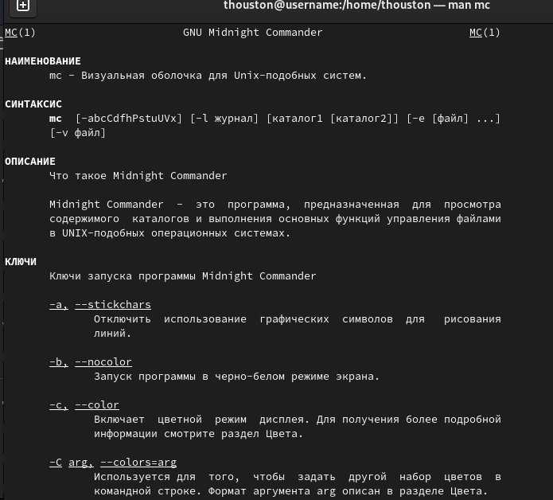{ #fig:001 width=70% }

## Выполнение лабораторной работы

2. Запустим из командной строки mc, изучим его структуру и меню. (рис. [-@fig:002])

{ #fig:002 width=70% }

## Выполнение лабораторной работы

3. Выполним несколько операций в mc, используя управляющие клавиши (операции
с панелями; выделение/отмена выделения файлов, копирование/перемещение файлов, получение информации о размере и правах доступа на файлы и/или каталоги и т.п.) (рис. [-@fig:003])

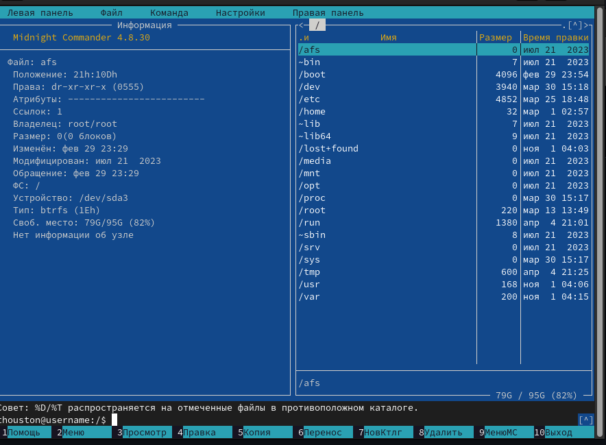{ #fig:003 width=70% }

## Выполнение лабораторной работы

4. Выполним основные команды меню левой (или правой) панели. Оцениv степень подробности вывода информации о файлах. (рис. [-@fig:004])

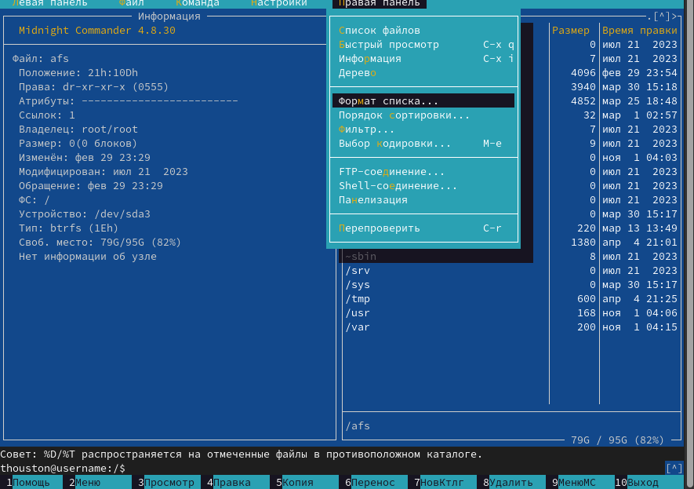{ #fig:004 width=70% }

## Выполнение лабораторной работы

5. Используя возможности подменю Файл , выполним:
– просмотр содержимого текстового файла;
– редактирование содержимого текстового файла (без сохранения результатов редактирования);
– создание каталога;
– копирование файлов в созданный каталог. (рис. [-@fig:005;-@fig:006;-@fig:007])

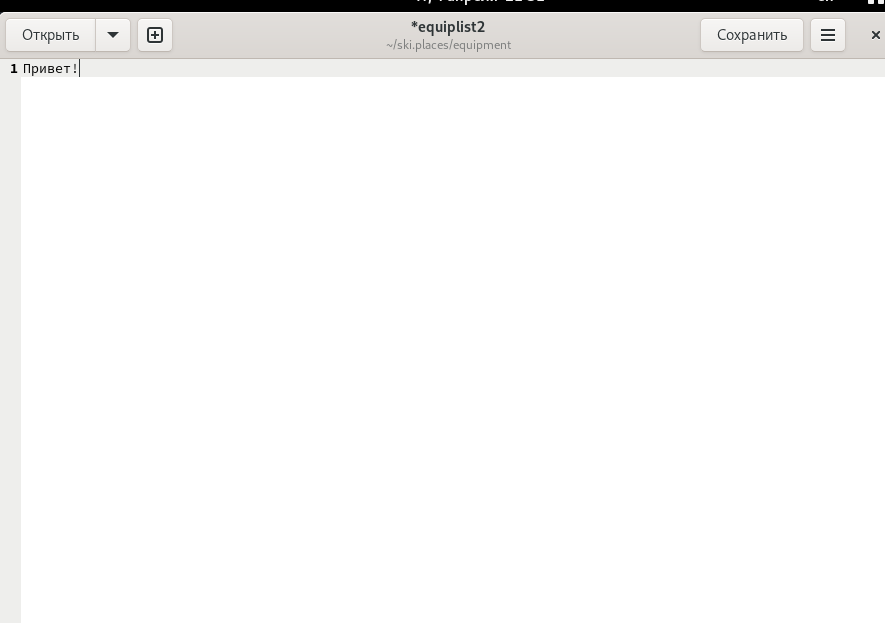{ #fig:005 width=40% }

## Выполнение лабораторной работы

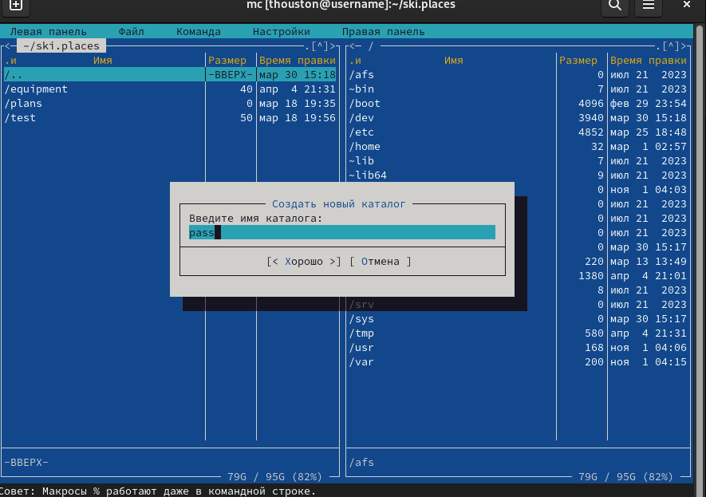{ #fig:006 width=60% }

## Выполнение лабораторной работы

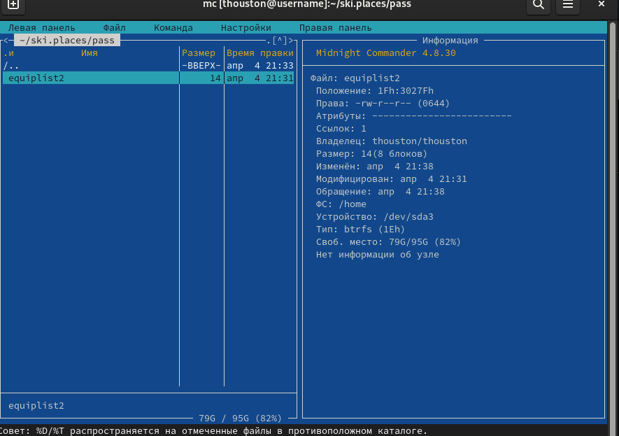{ #fig:007 width=60% }

## Выполнение лабораторной работы

6. С помощью соответствующих средств подменю Команда осуществим:
- поиск в файловой системе файла с заданными условиями (например, файла с расширением .c или .cpp, содержащего строку main);
- выбор и повторение одной из предыдущих команд;
- переход в домашний каталог;
- анализ файла меню и файла расширений. (рис. [-@fig:008;-@fig:009;-@fig:010;-@fig:011])

## Выполнение лабораторной работы

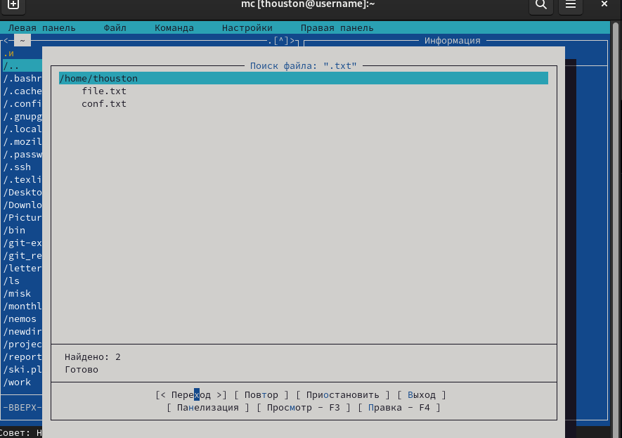{ #fig:008 width=60% }

## Выполнение лабораторной работы

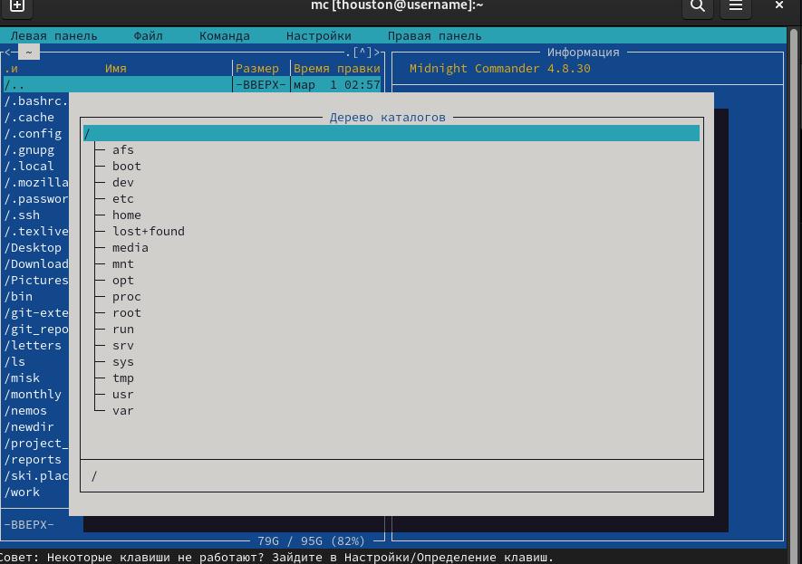{ #fig:009 width=60% }

## Выполнение лабораторной работы

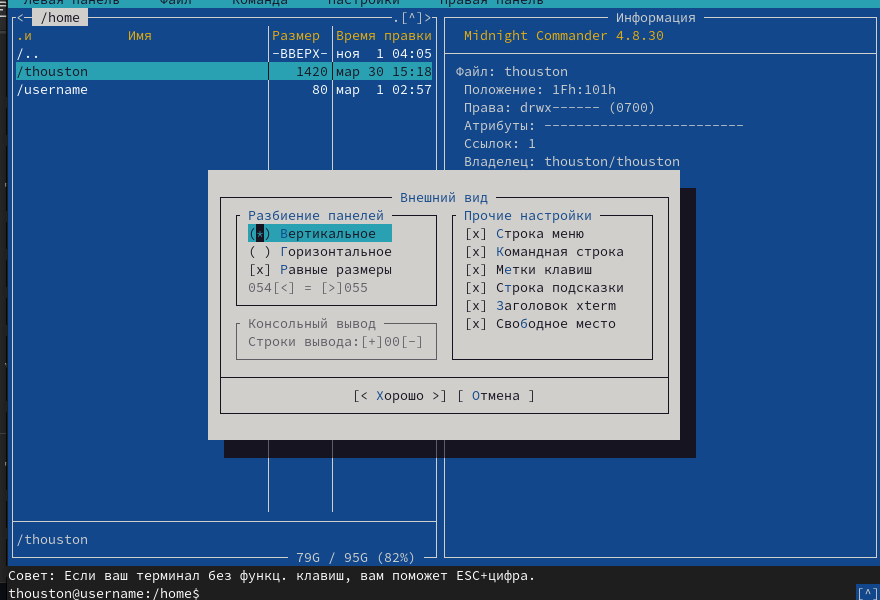{ #fig:010 width=70% }

## Выполнение лабораторной работы

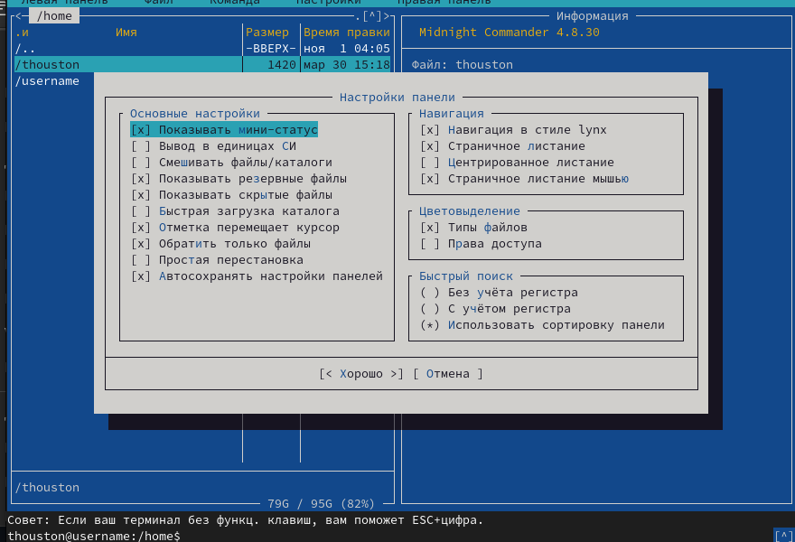{ #fig:011 width=70% }

## Выполнение лабораторной работы

7. Вызовим подменю Настройки. Освоим операции, определяющие структуру экрана mc (Full screen, Double Width, Show Hidden Files и т.д.) (рис. [-@fig:012;-@fig:013;-@fig:014])

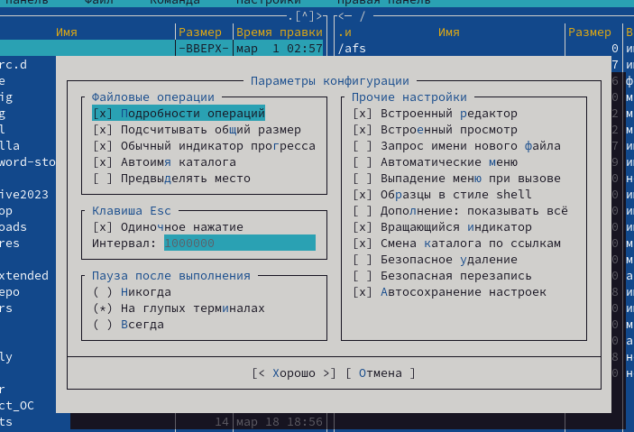{ #fig:012 width=50% }

## Выполнение лабораторной работы

{ #fig:013 width=60% }

## Выполнение лабораторной работы

{ #fig:014 width=60% }

## Выполнение лабораторной работы

Задание по встроенному редактору mc:
1. Создадим текстовой файл text.txt.
2. Откроем этот файл с помощью встроенного в mc редактора.
3. Вставим в открытый файл небольшой фрагмент текста, скопированный из любого другого файла или Интернета.
(рис. [-@fig:015])

{ #fig:015 width=40% }

## Выполнение лабораторной работы

4. Проделаем с текстом следующие манипуляции, используя горячие клавиши:
- Удалим строку текста.
- Выделим фрагмент текста и скопируем его на новую строку.
- Выделим фрагмент текста и перенесем его на новую строку.
- Сохраним файл.
- Отменим последнее действие.
- Перейдем в конец файла (нажав комбинацию клавиш) и напишем некоторый текст.
- Перейдем в начало файла (нажав комбинацию клавиш) и напишем некоторый текст.
- Сохраним и закроем файл.
 (рис. [-@fig:016])
 
## Выполнение лабораторной работы
 
{ #fig:016 width=70% }

## Выполнение лабораторной работы

5. Откроем файл с исходным текстом на некотором языке программирования (например C или Java)  (рис. [-@fig:017])

{ #fig:017 width=60% }

## Выполнение лабораторной работы

6. Используя меню редактора выключим подсветку синтаксиса.
 (рис. [-@fig:018])
 
{ #fig:018 width=60% }

## Выводы

В процессе выполнения лабораторной работы я освоила работу с командной оболочкой mc. Приобрела практические навыки работы по просмотру каталогов и файлов и по манипуляции с ними.

## Список литературы

1. Terminal Fedora [Электронный ресурс].

## {.standout}

Спасибо за внимание!
