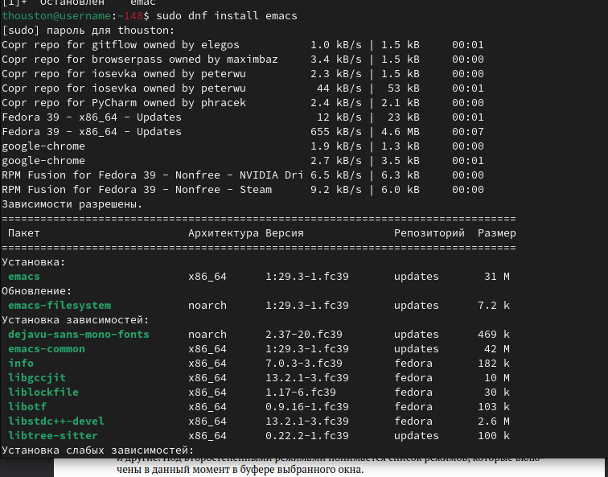
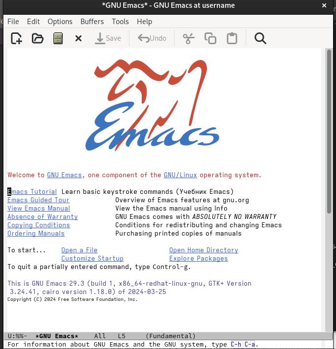
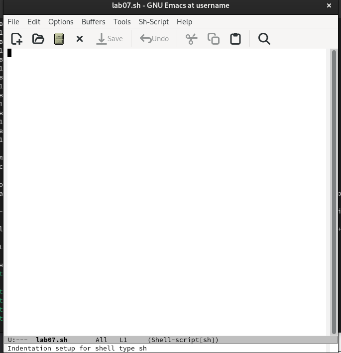
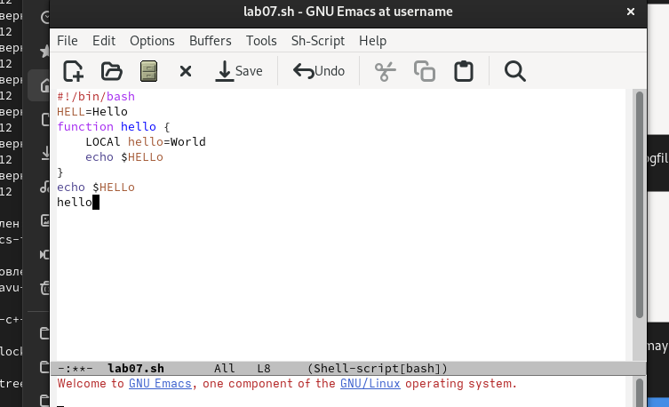
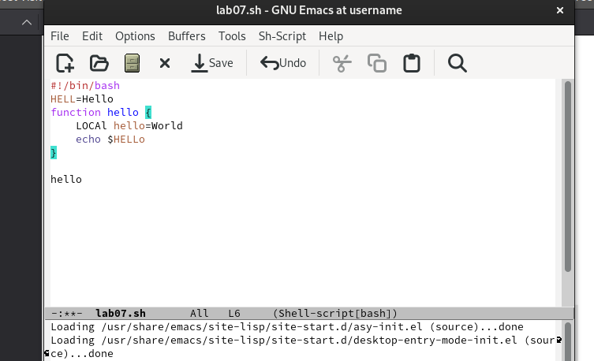
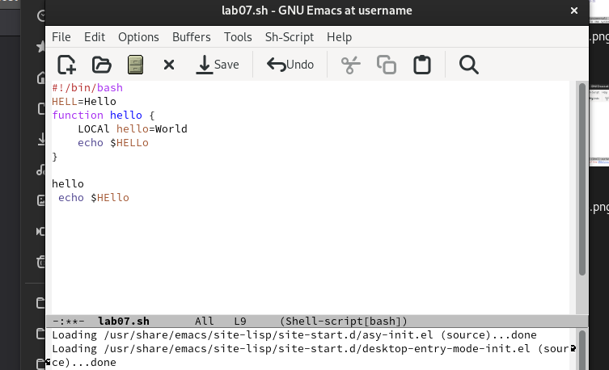
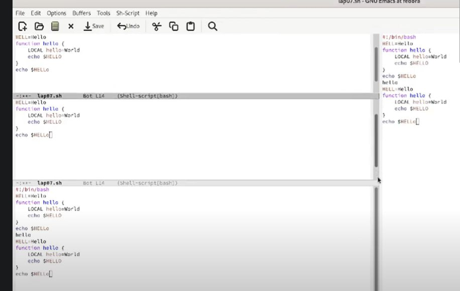
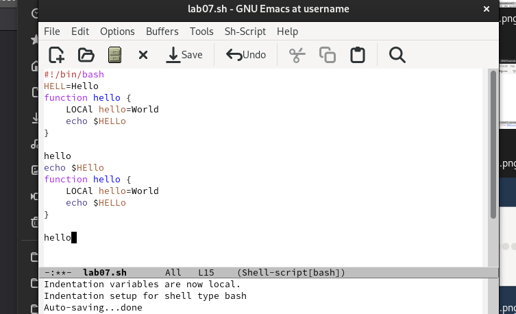
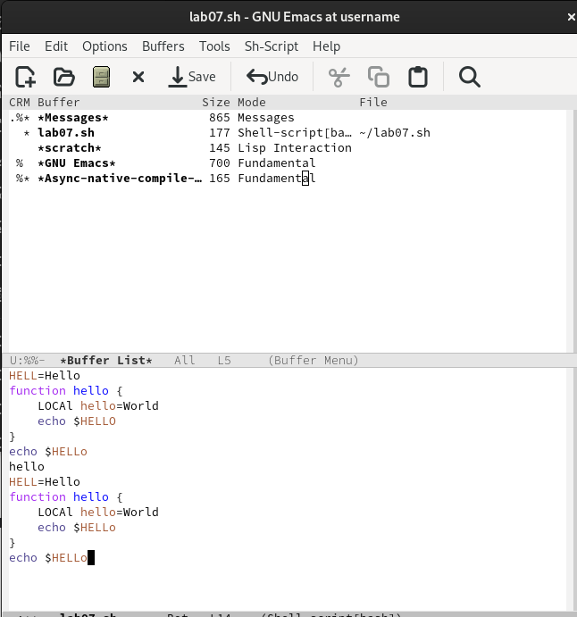
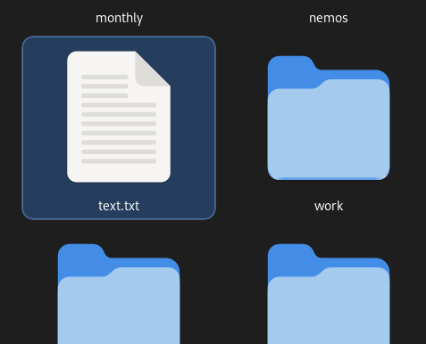

---
## Front matter
lang: ru-RU
title: Лабораторная работа № 11
subtitle: Текстовой редактор emacs
author:
  - Талебу т.Ф
institute:
  - Российский университет дружбы народов, Москва, Россия
  - Объединённый институт ядерных исследований, Дубна, Россия
date: 11 априля 1970

## i18n babel
babel-lang: russian
babel-otherlangs: english

## Formatting pdf
toc: false
toc-title: Содержание
slide_level: 2
aspectratio: 169
section-titles: true
theme: metropolis
header-includes:
 - \metroset{progressbar=frametitle,sectionpage=progressbar,numbering=fraction}
 - '\makeatletter'
 - '\beamer@ignorenonframefalse'
 - '\makeatother'
---

## Цели задачи

ознакомиться с операционной системой Linux. Получить практические навыки рабо-
ты с редактором Emacs.
# Задание 
1. Ознакомиться с теоретическим материалом.
2. Ознакомиться с редактором emacs.
3. Выполнить упражнения.
4. Ответить на контрольные вопросы.

## Выполнение лабораторной работы

(рис. [-@fig:001]).
{#fig:001 width=50%}
## Выполнение лабораторной работы

(рис. [-@fig:002]).
{#fig:002 width=50%}

## Выполнение лабораторной работы

(рис. [-@fig:003]).
{#fig:003 width=50%}

## Выполнение лабораторной работы

(рис. [-@fig:004]).
{#fig:004 width=50%}

## Выполнение лабораторной работы

(рис. [-@fig:005]).
{#fig:005 width=50%}
## Выполнение лабораторной работы

(рис. [-@fig:006]).
{#fig:006 width=50%}
## Выполнение лабораторной работы

(рис. [-@fig:057]).
{#fig:057 width=50%}
## Выполнение лабораторной работы

(рис. [-@fig:007]).
{#fig:007 width=50%}

## Выполнение лабораторной работы
(рис. [-@fig:008]).
{#fig:008 width=50%}

## Выполнение лабораторной работы

(рис. [-@fig:009]).
{#fig:009 width=50%}

## {.standout}

Спасибо за внимание!
:::

