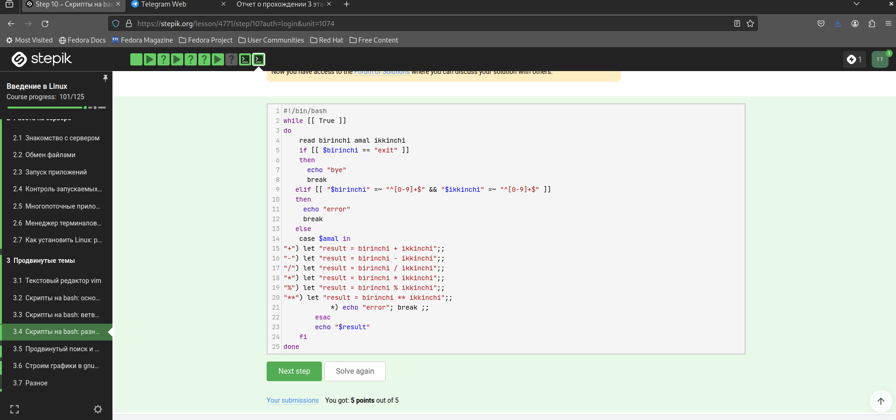

---
## Front matter
lang: ru-RU
title: внешний курс
subtitle: Продвинутые темы
author:
  - талебу тенке франк устон
institute:
  - Российский университет дружбы народов, Москва, Россия
  - Объединённый институт ядерных исследований, Дубна, Россия
date: 01 января 1970

## i18n babel
babel-lang: russian
babel-otherlangs: english

## Formatting pdf
toc: false
toc-title: Содержание
slide_level: 2
aspectratio: 169
section-titles: true
theme: metropolis
header-includes:
 - \metroset{progressbar=frametitle,sectionpage=progressbar,numbering=fraction}
 - '\makeatletter'
 - '\beamer@ignorenonframefalse'
 - '\makeatother'
---

## Цели и задачи
2.1 Знакомство с сервером
Вся вторая неделя курса посвящена работе на удаленных серверах. Кроме того, мы хотим обратить ваше внимание на то, что на этой неделе будет показан ряд примеров с использованием биоинформатических программ. Однако для выполнения этих заданий не нужно обладать никакими специальными знаниями или навыками в области биоинформатики или биологии, так что не стоит волноваться!

На первом занятии этой недели мы обсудим, что такое сервер и зачем на нем работать. Кроме того, мы рассмотрим два способа войти на удаленный сервер с помощью терминала.

## Выполнение лабораторной работы

{#fig:001 width=85%}

## Выполнение лабораторной работы

{#fig:002 width=85%}

## Выполнение лабораторной работы

{#fig:003 width=85%}

## Выполнение лабораторной работы

{#fig:004 width=85%}

## Выполнение лабораторной работы

{#fig:005 width=85%}

## Выполнение лабораторной работы

{#fig:006 width=85%}

## Выполнение лабораторной работы
{#fig:007 width=85%}

## Выполнение лабораторной работы
{#fig:008 width=85%}

## Выполнение лабораторной работы

{#fig:009 width=85%}

## Выполнение лабораторной работы
{#fig:010 width=85%}

## Выполнение лабораторной работы
{#fig:011 width=85%}

## Выполнение лабораторной работы
{#fig:012 width=85%}

## Выполнение лабораторной работы

{#fig:013 width=85%}

## Выполнение лабораторной работы

{#fig:014 width=85%}

## Выполнение лабораторной работы

{#fig:015 width=85%}

## Выполнение лабораторной работы

{#fig:016 width=85%}

## Выполнение лабораторной работы

{#fig:017 width=85%}

## Выполнение лабораторной работы

{#fig:018 width=85%}

## Выполнение лабораторной работы

{#fig:019 width=85%}

## Выполнение лабораторной работы

{#fig:020 width=85%}

## Выполнение лабораторной работы
{#fig:021 width=85%}

## Выполнение лабораторной работы

{#fig:022 width=85%}

## Выполнение лабораторной работы
{#fig:023 width=85%}

## Выполнение лабораторной работы

{#fig:024 width=85%}

## Выполнение лабораторной работы
{#fig:025 width=85%}

## Выполнение лабораторной работы

{#fig:026 width=85%}

## Выполнение лабораторной работы
{#fig:027 width=85%}

## Выполнение лабораторной работы

{#fig:028 width=85%}

## Выполнение лабораторной работы
{#fig:029 width=85%}

## Выполнение лабораторной работы

{#fig:030 width=85%}

