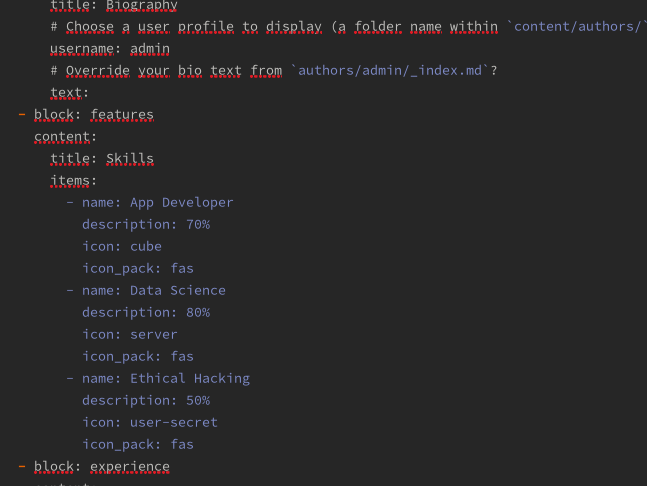
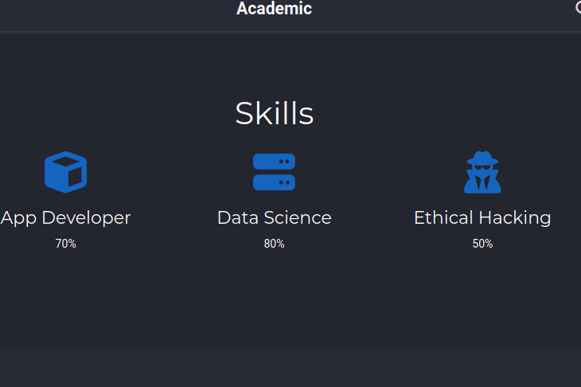
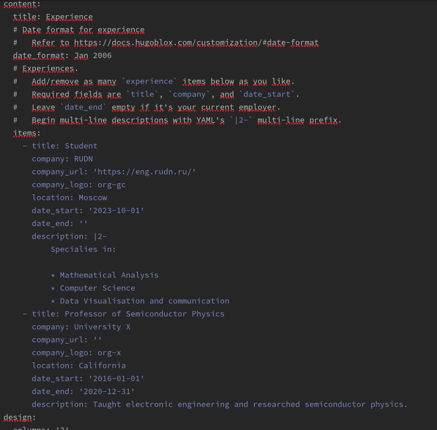
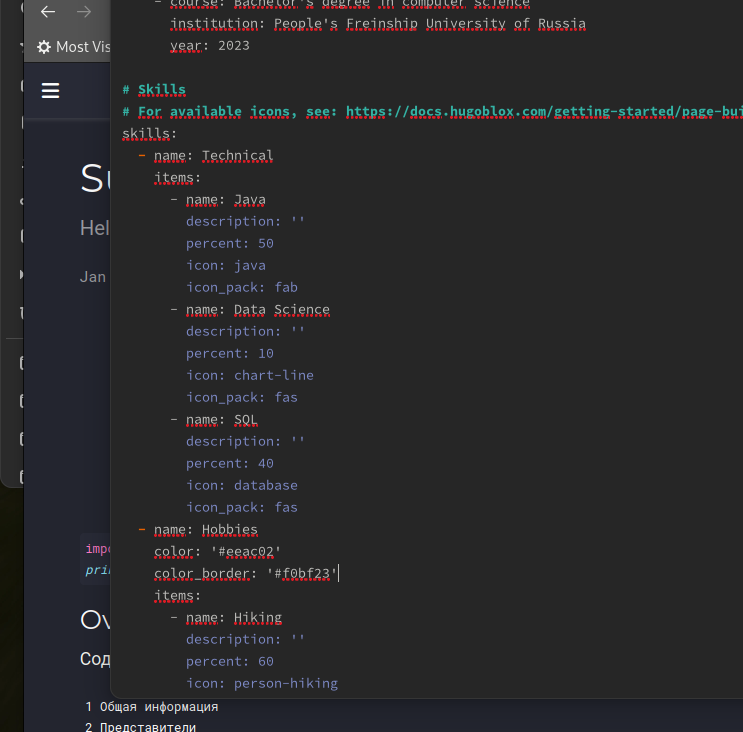
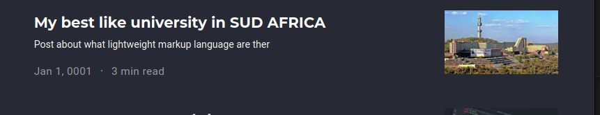
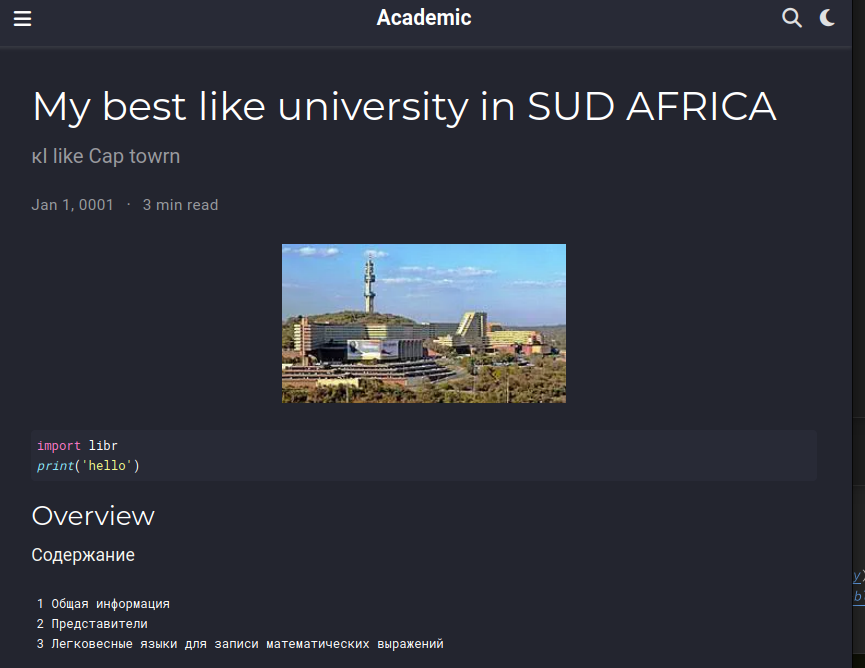
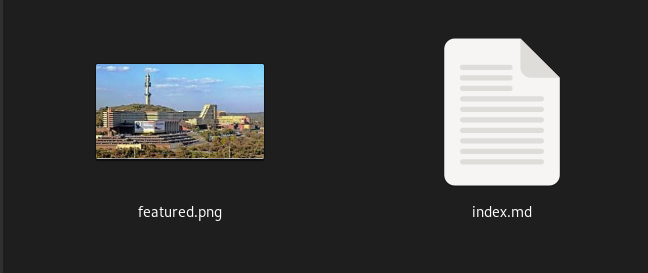
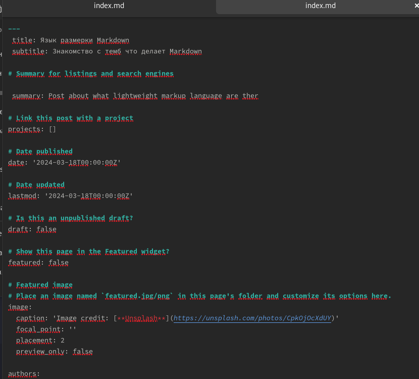
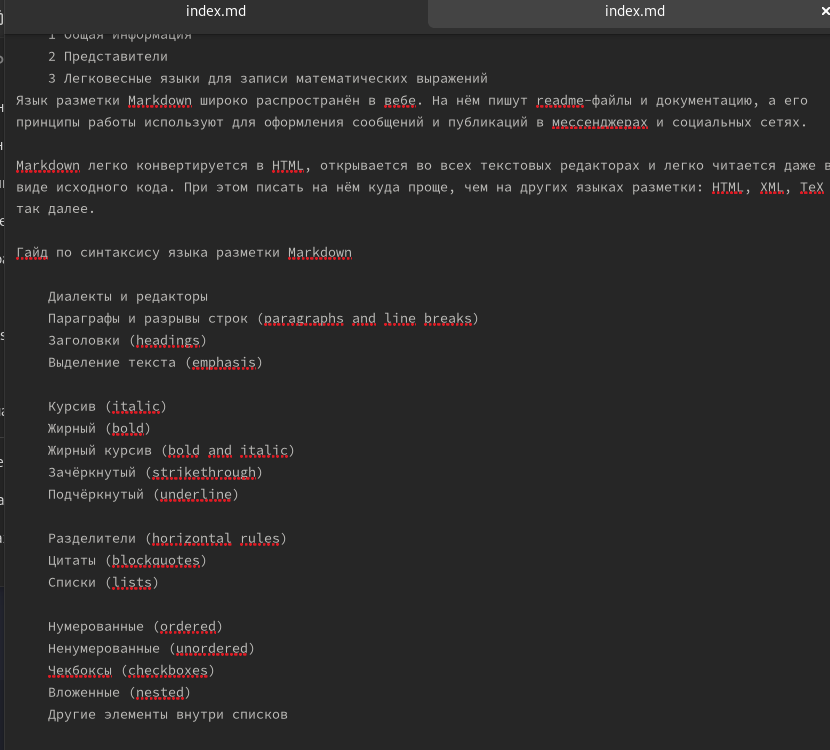
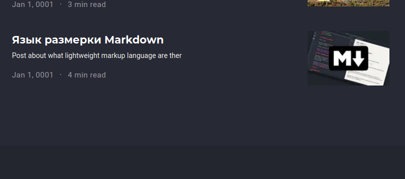

---
## Front matter
lang: ru-RU
title: "Третий этап индивидуалный проект"
subtitle: "Skills, Accomplish­ments and posts"
author: "Талебу тенке Франк устон"
institute:
  - Российский университет дружбы народов, Москва, Россия
  - Объединённый институт ядерных исследований, Дубна, Россия
date: 01 января 1970

## i18n babel
babel-lang: russian
babel-otherlangs: english

## Formatting pdf
toc: false
toc-title: Содержание
slide_level: 2
aspectratio: 169
section-titles: true
theme: metropolis
header-includes:
 - \metroset{progressbar=frametitle,sectionpage=progressbar,numbering=fraction}
 - '\makeatletter'
 - '\beamer@ignorenonframefalse'
 - '\makeatother'
---

# Информация

## Докладчик

:::::::::::::: {.columns align=center}
::: {.column width="70%"}

  * Кулябов Дмитрий Сергеевич
  * д.ф.-м.н., профессор
  * профессор кафедры прикладной информатики и теории вероятностей
  * Российский университет дружбы народов
  * [kulyabov-ds@rudn.ru](mailto:kulyabov-ds@rudn.ru)
  * <https://yamadharma.github.io/ru/>

:::
::: {.column width="30%"}

:::
::::::::::::::

## Содержание
   Список достижений.
    Добавить информацию о навыках (Skills).
    Добавить информацию об опыте (Experience).
    Добавить информацию о достижениях (Accomplishments).
    Сделать пост по прошедшей неделе.
    Добавить пост на тему по выбору:
       Легковесные языки разметки.
       Языки разметки. LaTeX.
       Язык разметки Markdown.

## Цель
    Список достижений.
    Добавить информацию о навыках (Skills).
    Добавить информацию об опыте (Experience).
    Добавить информацию о достижениях (Accomplishments).
    Сделать пост по прошедшей неделе.
    Добавить пост на тему по выбору:
    Легковесные языки разметки.
    Языки разметки. LaTeX.
    Язык разметки Markdown.

## Процесс выполнения

## Выполнение все примеры

 Добавить информацию о навыках (Skills).
    Добавить информацию об опыте (Experience).
    Добавить информацию о достижениях (Accomplishments).
    Сделать пост по прошедшей неделе.
    Язык разметки Markdown.

## Выполнение следующего действия
{#fig:001 width=100%}

## Выполнение следующего действия
{#fig:002 width=70%}

{#fig:003 width=70%}

## Выполнение следующего действия
{#fig:004 width=70%}

{#fig:005 width=70%}

## Выполнение следующего действия
{#fig:006 width=50%}

{#fig:007 width=50%}
{#fig:008 width=50%}
## Выполнение следующего действия
{#fig:009 width=50%}

{#fig:010 width=50%}

## Список литературы

1. Командная строка Windows [Электронный ресурс]. URL:
https://foxford.ru/wiki/informatika/komandnaya-stroka-windows.

## {.standout}

Спасибо за внимания

