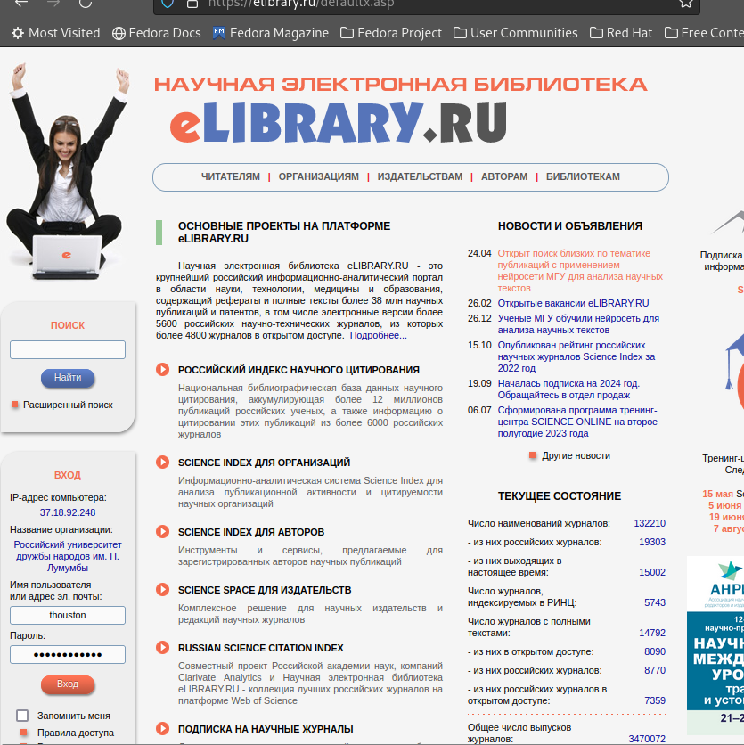
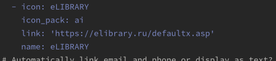
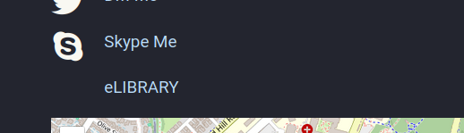
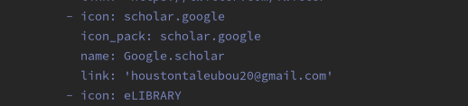
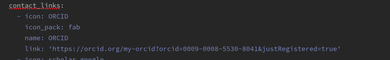
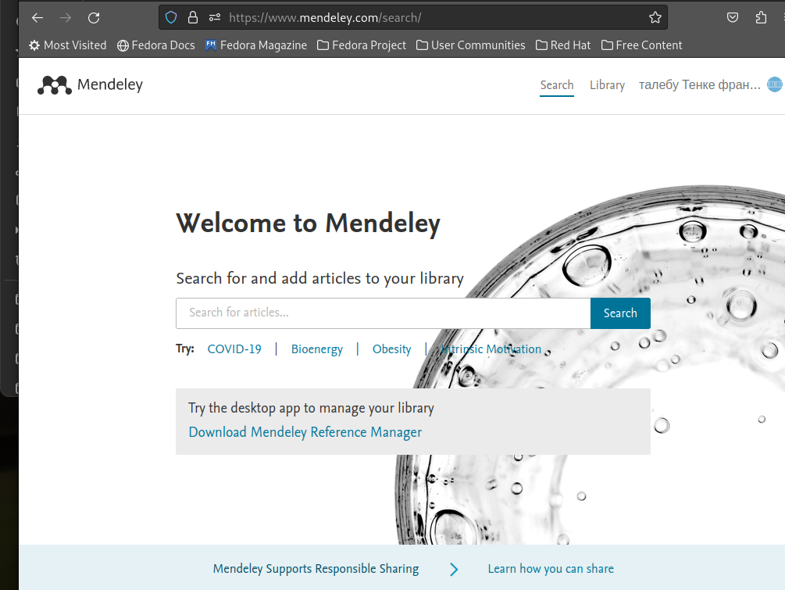
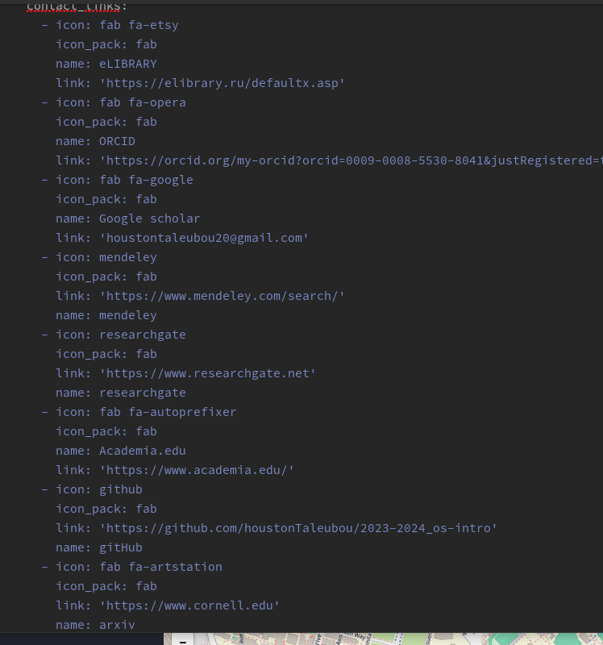
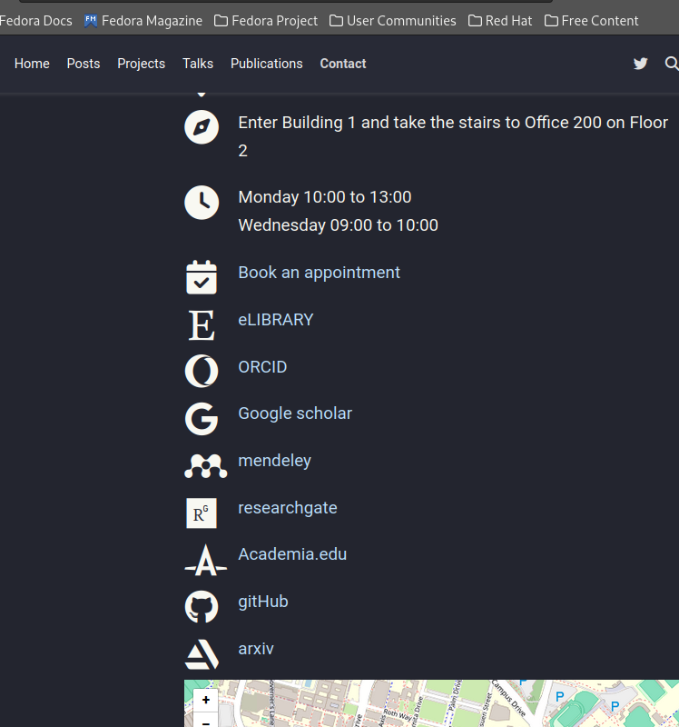
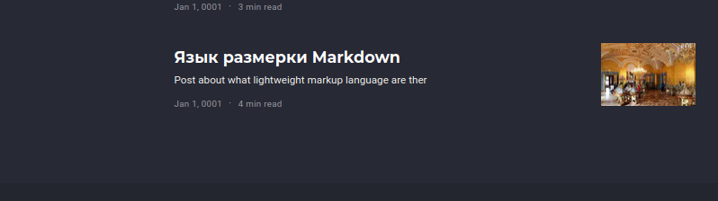

---
## Front matter
lang: ru-RU
title: 4 этап проэкта
author: |
	талебу тенке франк
institute: |
	\inst{1}RUDN University, Moscow, Russian Federation

## Formatting
toc: false
slide_level: 2
theme: metropolis
header-includes: 
 - \metroset{progressbar=frametitle,sectionpage=progressbar,numbering=fraction}
 - '\makeatletter'
 - '\beamer@ignorenonframefalse'
 - '\makeatother'
aspectratio: 43
section-titles: true
---

## Цель работы
Добавить к сайту ссылки на научные и библиометрические ресурсы.

## Задание
    Зарегистрироваться на соответствующих ресурсах и разместить на них ссылки на сайте:
        eLibrary : https://elibrary.ru/;
        Google Scholar : https://scholar.google.com/;
        ORCID : https://orcid.org/;
        Mendeley : https://www.mendeley.com/;
        ResearchGate : https://www.researchgate.net/;
        Academia.edu : https://www.academia.edu/;
        arXiv : https://arxiv.org/;
        github : https://github.com/.
    Сделать пост по прошедшей неделе.
    Добавить пост на тему по выбору:
        Оформление отчёта.
        Создание презентаций.
        Работа с библиографией.

## Выполнение лабораторной работы
 рис. ([-@fig:001;-@fig:002;-@fig:003])

## Выполнение лабораторной работы

{ #fig:001 width=70% }

## Выполнение лабораторной работы

{ #fig:002 width=70% }

## Выполнение лабораторной работы

{ #fig:003 width=70% }

## Выполнение лабораторной работы
([-@fig:004;-@fig:005])

## Выполнение лабораторной работы

{ #fig:004 width=70% }

## Выполнение лабораторной работы

{ #fig:005 width=70% }

## Выполнение лабораторной работы
([-@fig:006;-@fig:007;-@fig:008])

## Выполнение лабораторной работы

{ #fig:006 width=70% }

## Выполнение лабораторной работы
{ #fig:007 width=70% }

## Выполнение лабораторной работы

{ #fig:008 width=70% }

## Выполнение лабораторной работы
 ([-@fig:009;-@fig:010])

## Выполнение лабораторной работы

{ #fig:009 width=70% }

## Выполнение лабораторной работы
{ #fig:010 width=70% }

## Выводы

## Список литературы

 [Электронный ресурс]. URL: https://esystem.rudn.ru/mod/page/view.php?id=1098777

## {.standout}

Спасибо за внимание!
